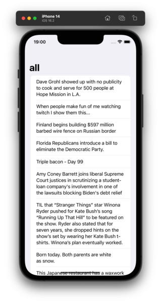

# KMP Sandbox

A sandbox project to explore Kotlin Multiplatform.


This is not intended to be a guide or anything related. I'm just trying to explore what's possible, the current state of the framework/tools, etc. But I'll do my explorations here in an open way, so it may be useful to other people.

## Initial Goals

- [x] To have a buildable empty project on Android and iOS with a single shared module
- [x] Add `shared` module as dependency on both Android and iOS apps
- [x] To have an empty screen (Compose-based on Android, SwiftUI-based on iOS) consuming a single method from the shared module
- [x] Configure Github Actions to make APK available to download
- [x] Setup [Kotlin Multiplatform Serialization](https://github.com/Kotlin/kotlinx.serialization) on the `shared`
- [ ] Setup [Ktor](https://ktor.io/) client on the `shared` module, and its JSON support using **KMS**
- [ ] Setup [Detekt](https://detekt.dev/) and [SwiftLint](https://realm.github.io/SwiftLint/) to avoid accumulation of issues
- [ ] (Maybe) include the [Jetpack Compose Rules](https://mrmans0n.github.io/compose-rules/detekt/) with Detekt
- [ ] Create a [Reddit](https://www.reddit.com/dev/api/) Application to be used with this project and setup the secrets on Github Actions
- [ ] Create a `/r/frontpage/hot` mockup on Android (with static data, text only)
- [ ] Craate a `/r/frontpage/hot` mockup on iOS (with static data, text only)
- [ ] Map basic endpoints / data models from Reddit API in the `shared` module
- [ ] millions of intermediate steps
- [ ] A working client for the Reddit API. Why Reddit? Because I find their API a bit too much complex. So it would be a good exercise to consume it in a clean way.

## Current State

| iOS | Android |
| --- | --- |
 |  |  |

## License

```
MIT License

Copyright (c) 2023 Rafael Toledo

Permission is hereby granted, free of charge, to any person obtaining a copy
of this software and associated documentation files (the "Software"), to deal
in the Software without restriction, including without limitation the rights
to use, copy, modify, merge, publish, distribute, sublicense, and/or sell
copies of the Software, and to permit persons to whom the Software is
furnished to do so, subject to the following conditions:

The above copyright notice and this permission notice shall be included in all
copies or substantial portions of the Software.

THE SOFTWARE IS PROVIDED "AS IS", WITHOUT WARRANTY OF ANY KIND, EXPRESS OR
IMPLIED, INCLUDING BUT NOT LIMITED TO THE WARRANTIES OF MERCHANTABILITY,
FITNESS FOR A PARTICULAR PURPOSE AND NONINFRINGEMENT. IN NO EVENT SHALL THE
AUTHORS OR COPYRIGHT HOLDERS BE LIABLE FOR ANY CLAIM, DAMAGES OR OTHER
LIABILITY, WHETHER IN AN ACTION OF CONTRACT, TORT OR OTHERWISE, ARISING FROM,
OUT OF OR IN CONNECTION WITH THE SOFTWARE OR THE USE OR OTHER DEALINGS IN THE
SOFTWARE.
```
